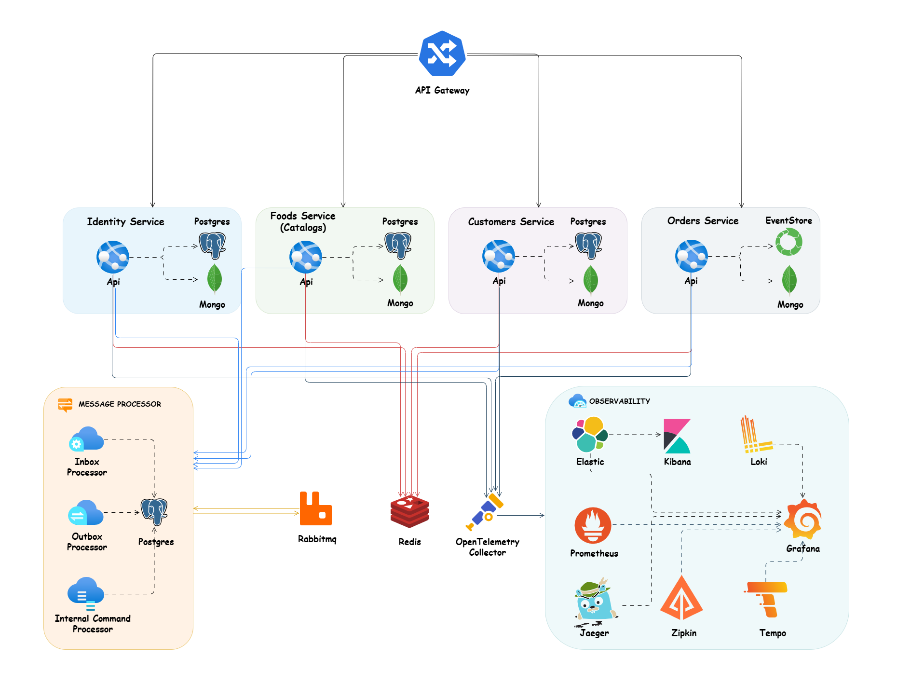
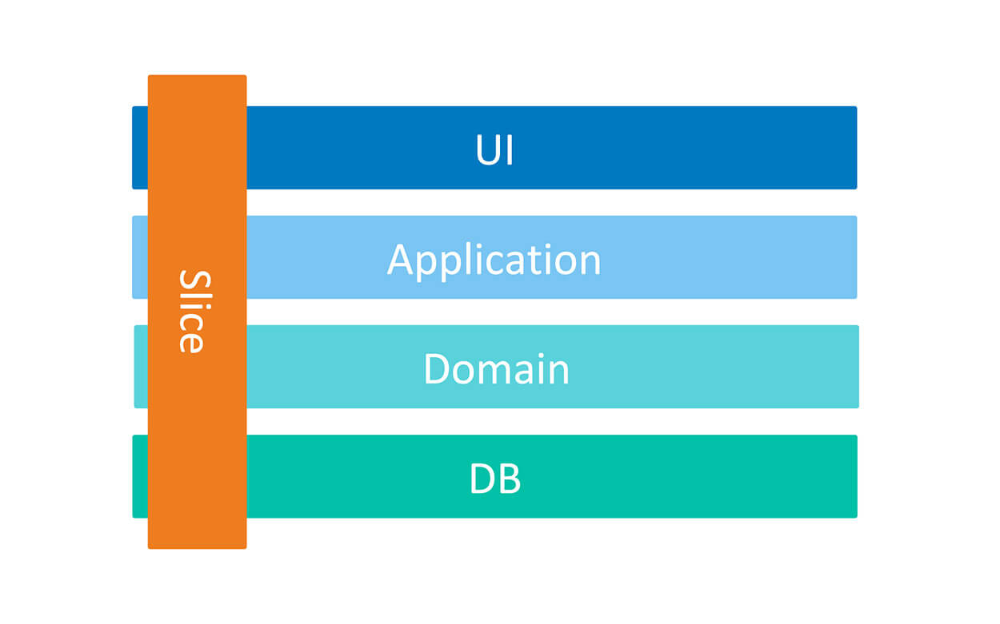
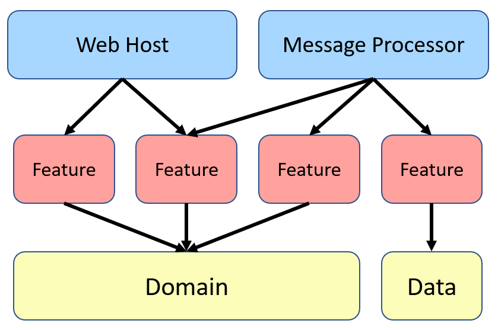

# 🍔 Food Delivery Microservices

[](https://codespaces.new/mehdihadeli/food-delivery-microservices)

<!-- https://raw.githubusercontent.com/progfay/shields-with-icon/master/README.md -->

> Food Delivery Microservices is a practical and cloud-native food delivery microservices built with **.NET Aspire**, **.Net Core** and different software architecture and technologies like **Microservices Architecture**, **Vertical Slice Architecture** , **CQRS Pattern**, **Domain Driven Design (DDD)**, **Event Driven Architecture**. For communication between independent services, we use asynchronous messaging with RabbitMQ and Wolverine, and sometimes we use synchronous communication for real-time communications with REST and gRPC calls.

💡 This application is not business oriented and my focus is mostly on technical part, I just want to implement a sample with using different technologies, software architecture design, principles and all the thing we need for creating a microservices app.

> **Warning**
> This project is in progress. I add new features over the time. You can check the [Release Notes](https://github.com/mehdihadeli/food-delivery-microservices/releases).

🎯 This Application ported to `modular monolith` approach in [food-delivery-modular-monolith](https://github.com/mehdihadeli/food-delivery-modular-monolith) repository, we can choose best fit architecture for our projects based on production needs.

Other versions of this project are available in these repositories, We can choose best fit architecture for our projects based on production needs:

- [https://github.com/mehdihadeli/food-delivery-modular-monolith](https://github.com/mehdihadeli/food-delivery-modular-monolith)
- [https://github.com/mehdihadeli/go-food-delivery-microservices](https://github.com/mehdihadeli/go-food-delivery-microservices)

For your simplest .net core projects, you can use my `vertical-slice-api-template` project template:

- [https://github.com/mehdihadeli/vertical-slice-api-template](https://github.com/mehdihadeli/vertical-slice-api-template)

## ⭐ Support

🌟 Don't forget to [star (🌟) this repo](https://docs.github.com/en/get-started/exploring-projects-on-github/saving-repositories-with-stars) to find it easier later and Support.

## Table of Contents

- [🍔 Food Delivery Microservices](#-food-delivery-microservices)
  - [⭐ Support](#-support)
  - [Table of Contents](#table-of-contents)
  - [Features](#features)
  - [Plan](#plan)
  - [Technologies - Libraries](#technologies---libraries)
  - [The Domain And Bounded Context - Service Boundary](#the-domain-and-bounded-context---service-boundary)
  - [Application Architecture](#application-architecture)
  - [Application Structure](#application-structure)
    - [High Level Structure](#high-level-structure)
  - [Vertical Slice Flow](#vertical-slice-flow)
  - [Prerequisites](#prerequisites)
  - [Setup](#setup)
    - [Dev Certificate](#dev-certificate)
    - [Conventional Commit](#conventional-commit)
    - [Formatting](#formatting)
    - [Analizers](#analizers)
  - [How to Run](#how-to-run)
    - [Using Docker-Compose](#using-docker-compose)
    - [Using Kubernetes](#using-kubernetes)
      - [Plain Kubernetes](#plain-kubernetes)
        - [Prerequisites](#prerequisites-1)
        - [Installation](#installation)
  - [Contribution](#contribution)
  - [Project References](#project-references)
  - [License](#license)

## Features

- ✅ Using `Microservices` and `Vertical Slice Architecture` as a high level architecture
- ✅ Using `Event Driven Architecture` on top of RabbitMQ Message Broker and Wolverine
- ✅ Using `Domain Driven Design`in most of services like Customers, Catalogs, ...
- ✅ Using `Event Sourcing` and `EventStoreDB` in `Audit Based` services like Orders, Payment
- ✅ Using `Data Centeric Architecture` based on `CRUD` in Identity Service
- ✅ Using `CQRS Pattern` on top of `MediatR` library and spliting `read models` and `write models`
- ✅ Using `OpenTelemetry Collector` to receive, process, and export telemetry data to various backends, including Jaeger and Tempo for tracing, Loki and Kibana for logs, and Prometheus for metrics.
- ✅ Using Wolverine durable messaging with PostgreSQL persistence for `Outbox`, `Inbox`, and durable local processing in a transactional boundary with EF Core
- ✅ Using Wolverine durable inbox for handling [Idempotency](https://www.cloudcomputingpatterns.org/idempotent_processor/) in receiver side and practical exactly-once processing semantics per message id
- ✅ Using `UnitTests` and `NSubstitute` for mocking dependencies
- ✅ Using `Integration Tests` and `End To End Tests` on top of [testcontainers-dotnet](https://github.com/testcontainers/testcontainers-dotnet) library for cleanup our test enviroment through docker containers
- ✅ Using `Minimal APIs` for handling requests
- ✅ Using `Fluent Validation` and a [Validation Pipeline Behaviour](./src/BuildingBlocks/BuildingBlocks.Validation/RequestValidationBehavior.cs) on top of MediatR
- ✅ Using `Postgres` for write database as relational DB and `MongoDB` and `Elasric Search` for read database
- ✅ Using docker and `docker-compose` for deployment
- ✅ Using [YARP](https://microsoft.github.io/reverse-proxy/) reverse proxy as API Gateway
- ✅ Using different type of tests like `Unit Tests`, `Integration Tests`, `End-To-End Tests` and [testcontainers](https://microsoft.github.io/reverse-proxy/) for testing in isolation
- ✅ Using `OpenTelemetry` for collecting `Metrics` and `Distributed Traces`
- ✅ Using .NET Aspire for cloud-native application orchestration and enhanced developer experience
- 🚧 Using `Helm`, `Kubernetes` and `Kustomize` for deployment

## Plan

> This project is in progress, new features will be added over time.

| Feature | Architecture Pattern | Status | CI-CD |
| ------- | -------------------- | ------ | ----- |

## Technologies - Libraries

- ✔️ **[`.NET 9`](https://dotnet.microsoft.com/download)** - .NET Framework and .NET Core, including ASP.NET and ASP.NET Core
- ✔️ **[`Wolverine`](https://wolverinefx.io/)** - Message bus and transactional messaging framework for .NET
- ✔️ **[`StackExchange.Redis`](https://github.com/StackExchange/StackExchange.Redis)** - General purpose redis client
- ✔️ **[`Npgsql Entity Framework Core Provider`](https://www.npgsql.org/efcore/)** - Npgsql has an Entity Framework (EF) Core provider. It behaves like other EF Core providers (e.g. SQL Server), so the general EF Core docs apply here as well
- ✔️ **[`EventStore-Client-Dotnet`](https://github.com/EventStore/EventStore-Client-Dotnet)** - Dotnet Client SDK for the Event Store gRPC Client API written in C#
- ✔️ **[`FluentValidation`](https://github.com/FluentValidation/FluentValidation)** - Popular .NET validation library for building strongly-typed validation rules
- ✔️ **[`Swagger & Swagger UI`](https://github.com/domaindrivendev/Swashbuckle.AspNetCore)** - Swagger tools for documenting API's built on ASP.NET Core
- ✔️ **[`Serilog`](https://github.com/serilog/serilog)** - Simple .NET logging with fully-structured events
- ✔️ **[`Polly`](https://github.com/App-vNext/Polly)** - Polly is a .NET resilience and transient-fault-handling library that allows developers to express policies such as Retry, Circuit Breaker, Timeout, Bulkhead Isolation, and Fallback in a fluent and thread-safe manner
- ✔️ **[`Scrutor`](https://github.com/khellang/Scrutor)** - Assembly scanning and decoration extensions for Microsoft.Extensions.DependencyInjection
- ✔️ **[`Opentelemetry-dotnet`](https://github.com/open-telemetry/opentelemetry-dotnet)** - The OpenTelemetry .NET Client
- ✔️ **[`DuendeSoftware IdentityServer`](https://github.com/DuendeSoftware/IdentityServer)** - The most flexible and standards-compliant OpenID Connect and OAuth 2.x framework for ASP.NET Core
- ✔️ **[`Newtonsoft.Json`](https://github.com/JamesNK/Newtonsoft.Json)** - Json.NET is a popular high-performance JSON framework for .NET
- ✔️ **[`Rabbitmq-dotnet-client`](https://github.com/rabbitmq/rabbitmq-dotnet-client)** - RabbitMQ .NET client for .NET Standard 2.0+ and .NET 4.6.1+
- ✔️ **[`AspNetCore.Diagnostics.HealthChecks`](https://github.com/Xabaril/AspNetCore.Diagnostics.HealthChecks)** - Enterprise HealthChecks for ASP.NET Core Diagnostics Package
- ✔️ **[`Microsoft.AspNetCore.Authentication.JwtBearer`](https://www.nuget.org/packages/Microsoft.AspNetCore.Authentication.JwtBearer)** - Handling Jwt Authentication and authorization in .Net Core
- ✔️ **[`NSubstitute`](https://github.com/nsubstitute/NSubstitute)** - A friendly substitute for .NET mocking libraries.
- ✔️ **[`StyleCopAnalyzers`](https://github.com/DotNetAnalyzers/StyleCopAnalyzers)** - An implementation of StyleCop rules using the .NET Compiler Platform
- ✔️ **[`Mapperly`](https://github.com/riok/mapperly)** - A .NET source generator for generating object mappings, No runtime reflection.
- ✔️ **[`IdGen`](https://github.com/RobThree/IdGen)** - Twitter Snowflake-alike ID generator for .Net

## The Domain And Bounded Context - Service Boundary

TODO

## Application Architecture

The bellow architecture shows that there is one public API (API Gateway) which is accessible for the clients and this is done via HTTP request/response. The API gateway then routes the HTTP request to the corresponding microservice. The HTTP request is received by the microservice that hosts its own REST API. Each microservice is running within its own `AppDomain` and has directly access to its own dependencies such as databases, files, local transaction, etc. All these dependencies are only accessible for that microservice and not to the outside world. In fact microservices are decoupled from each other and are autonomous. This also means that the microservice does not rely on other parts in the system and can run independently of other services.



Microservices are [event based](https://event-driven.io/en/internal_external_events/) which means they can publish and/or subscribe to any events occurring in the setup. By using this approach for communicating between services, each microservice does not need to know about the other services or handle errors occurred in other microservices.

In this architecture we use [CQRS Pattern](https://www.kurrent.io/cqrs-pattern) for separating read and write model beside of other [CQRS Advantages](https://youtu.be/dK4Yb6-LxAk?t=1029). Here for now I don't use [Event Sourcing](https://www.kurrent.io/blog/event-sourcing-and-cqrs) for simplicity but I will use it in future for syncing read and write side with sending streams and using [Projection Feature](https://event-driven.io/en/projections_and_read_models_in_event_driven_architecture/) for some subscribers to syncing their data through sent streams and creating our [Custom Read Models](https://codeopinion.com/projections-in-event-sourcing-build-any-model-you-want/) in subscribers side.

Here I have a write model that uses a postgres database for handling better `Consistency` and `ACID Transaction` guaranty. beside o this write side I use a read side model that uses MongoDB for better performance of our read side without any joins with suing some nested document, also better scalability with some good scaling features in MongoDB.

## Wolverine Transactional Messaging

This repository now uses `Wolverine` as the single durable messaging runtime for broker publishing, inbound idempotency, and internal asynchronous processing. The old custom polling outbox and inbox implementation is replaced in the active Wolverine-based services by Wolverine durability primitives.

### What Wolverine Handles

- `Outbox`: integration events are written through Wolverine using PostgreSQL durability and flushed in the same application transaction boundary as EF Core changes.
- `Inbox`: RabbitMQ consumers use Wolverine durable inbox so duplicate deliveries are detected and skipped by Wolverine instead of our own inbox table and background worker.
- `Internal processor`: internal commands and domain notifications are sent to durable local queues, so asynchronous in-process work is persisted and retried by Wolverine.
- `Broker transport`: Wolverine continues to own RabbitMQ publishing and consuming with the same message contracts.

### Transaction Boundary

For command handling we keep the existing EF Core transactional pipeline and enroll the active `DbContext` into Wolverine's EF Core outbox support. That means one logical unit of work covers:

1. domain state changes in PostgreSQL
2. durable storage of outgoing integration events
3. durable storage of internal commands and notifications

If the transaction fails, none of those messages are committed. If the transaction succeeds, Wolverine owns delivery and retries. This keeps messaging code smaller while preserving the same reliability goal as the custom outbox/inbox implementation.

For syncing our read side and write side we have 2 options with using Event Driven Architecture (without using events streams in event sourcing):

- If our `Read Sides` are in `Same Service`, during saving data in write side I enqueue a durable local message with Wolverine. After committing write side, Wolverine dispatches that internal command or notification to its handler in same service and that handler can update MongoDB read models.

- If our `Read Sides` are in `Another Services` we publish an integration event through Wolverine durable messaging after committing our write side and all of our `Subscribers` could get this event and save it in their read models (MongoDB).

All of this is optional in the application and it is possible to only use what that the service needs. Eg. if the service does not want to Use DDD because of business is very simple and it is mostly `CRUD` we can use `Data Centric` Architecture or If our application is not `Task based` instead of CQRS and separating read side and write side again we can just use a simple `CRUD` based application.

Here I used [Outbox](http://www.kamilgrzybek.com/design/the-outbox-pattern/) for [Guaranteed Delivery](https://www.enterpriseintegrationpatterns.com/patterns/messaging/GuaranteedMessaging.html), but the implementation is now Wolverine durability instead of a custom message persistence worker.

[Outbox pattern](https://event-driven.io/en/outbox_inbox_patterns_and_delivery_guarantees_explained/) ensures that a message is stored durably as part of same transaction as business data changes and then delivered to the broker with retries. In this repository Wolverine persists those outgoing messages in PostgreSQL and flushes them after the EF Core transaction commits. We still get [At-least-once Delivery](https://www.cloudcomputingpatterns.org/at_least_once_delivery/), but we no longer need our own polling `MessagePersistenceBackgroundService` to push records to RabbitMQ.

We should remember this and try to design receivers of our messages as [Idempotents](https://www.enterpriseintegrationpatterns.com/patterns/messaging/IdempotentReceiver.html), which means:

> In Messaging this concepts translates into a message that has the same effect whether it is received once or multiple times. This means that a message can safely be resent without causing any problems even if the receiver receives duplicates of the same message.

For handling [Idempotency](https://www.enterpriseintegrationpatterns.com/patterns/messaging/IdempotentReceiver.html) and [Exactly-once Delivery](https://www.cloudcomputingpatterns.org/exactly_once_delivery/) in receiver side, we use Wolverine durable inbox.

This pattern is similar to Outbox Pattern. It’s used to handle incoming messages (e.g. from a queue) for `unique processing` of `a single message` only `once` even when RabbitMQ redelivers the same message. Wolverine stores and checks message identity for us, retries failures, and acknowledges successful processing back to the broker. That keeps consumer code focused on business handling instead of custom deduplication infrastructure.

Also here I used `RabbitMQ` as my `Message Broker` for my async communication between the microservices with using eventually consistency mechanism, and Wolverine for broker communications. beside of this eventually consistency we have a synchronous call with using `REST` (in future I will use gRpc) for our immediate consistency needs.

We use a `Api Gateway` and here I used [YARP](https://microsoft.github.io/reverse-proxy/articles/getting-started.html) that is microsoft reverse proxy (we could use envoy, traefik, Ocelot, ...), in front of our services, we could also have multiple Api Gateway for reaching [BFF pattern](https://blog.bitsrc.io/bff-pattern-backend-for-frontend-an-introduction-e4fa965128bf). for example one Gateway for mobile apps, One Gateway for web apps and etc.
With using api Gateway our internal microservices are transparent and user can not access them directly and all requests will serve through this Gateway.
Also we could use gateway for load balancing, authentication and authorization, caching ,...

## Application Structure

In this project I used [vertical slice architecture](https://jimmybogard.com/vertical-slice-architecture/) or [Restructuring to a Vertical Slice Architecture](https://codeopinion.com/restructuring-to-a-vertical-slice-architecture/) also I used [feature folder structure](http://www.kamilgrzybek.com/design/feature-folders/) in this project.

- We treat each request as a distinct use case or slice, encapsulating and grouping all concerns from front-end to back.
- When We adding or changing a feature in an application in n-tire architecture, we are typically touching many different "layers" in an application. we are changing the user interface, adding fields to models, modifying validation, and so on. Instead of coupling across a layer, we couple vertically along a slice and each change affects only one slice.
- We `Minimize coupling` `between slices`, and `maximize coupling` `in a slice`.
- With this approach, each of our vertical slices can decide for itself how to best fulfill the request. New features only add code, we're not changing shared code and worrying about side effects. For implementing vertical slice architecture using cqrs pattern is a good match.





Also here I used [CQRS](https://www.eventecommerce.com/cqrs-pattern) for decompose my features to very small parts that makes our application:

- maximize performance, scalability and simplicity.
- adding new feature to this mechanism is very easy without any breaking change in other part of our codes. New features only add code, we're not changing shared code and worrying about side effects.
- easy to maintain and any changes only affect on one command or query (or a slice) and avoid any breaking changes on other parts
- it gives us better separation of concerns and cross cutting concern (with help of MediatR behavior pipelines) in our code instead of a big service class for doing a lot of things.

With using [CQRS](https://event-driven.io/en/cqrs_facts_and_myths_explained/), our code will be more aligned with [SOLID principles](https://en.wikipedia.org/wiki/SOLID), especially with:

- [Single Responsibility](https://en.wikipedia.org/wiki/Single-responsibility_principle) rule - because logic responsible for a given operation is enclosed in its own type.
- [Open-Closed](https://en.wikipedia.org/wiki/Open%E2%80%93closed_principle) rule - because to add new operation you don’t need to edit any of the existing types, instead you need to add a new file with a new type representing that operation.

Here instead of some [Technical Splitting](http://www.kamilgrzybek.com/design/feature-folders/) for example a folder or layer for our `services`, `controllers` and `data models` which increase dependencies between our technical splitting and also jump between layers or folders, We cut each business functionality into some vertical slices, and inner each of these slices we have [Technical Folders Structure](http://www.kamilgrzybek.com/design/feature-folders/) specific to that feature (command, handlers, infrastructure, repository, controllers, data models, ...).

Usually, when we work on a given functionality we need some technical things for example:

- API endpoint (Controller)
- Request Input (Dto)
- Request Output (Dto)
- Some class to handle Request, For example Command and Command Handler or Query and Query Handler
- Data Model

Now we could all of these things beside each other and it decrease jumping and dependencies between some layers or folders.

Keeping such a split works great with CQRS. It segregates our operations and slices the application code vertically instead of horizontally. In Our CQRS pattern each command/query handler is a separate slice. This is where you can reduce coupling between layers. Each handler can be a separated code unit, even copy/pasted. Thanks to that, we can tune down the specific method to not follow general conventions (e.g. use custom SQL query or even different storage). In a traditional layered architecture, when we change the core generic mechanism in one layer, it can impact all methods.

### High Level Structure

TODO

## Vertical Slice Flow

TODO

## Prerequisites

1. This application uses `Https` for hosting apis, to setup a valid certificate on your machine, you can create a [Self-Signed Certificate](https://learn.microsoft.com/en-us/aspnet/core/security/docker-https?view=aspnetcore-7.0#macos-or-linux), see more about enforce certificate [here](https://learn.microsoft.com/en-us/aspnet/core/security/enforcing-ssl).
2. Install git - [https://git-scm.com/downloads](https://git-scm.com/downloads).
3. Install latest .NET version - [https://dotnet.microsoft.com/en-us/download](https://dotnet.microsoft.com/en-us/download).
4. Install Visual Studio, Rider or VSCode.
5. Install docker - [https://docs.docker.com/docker-for-windows/install/](https://docs.docker.com/docker-for-windows/install/).
6. Make sure that you have ~10GB disk space.
7. Clone Project [https://github.com/mehdihadeli/food-delivery-microservices](https://github.com/mehdihadeli/food-delivery-microservices), make sure that's compiling
8. Run the [docker-compose.infrastructure.yaml](deployments/docker-compose/docker-compose.infrastructure.yaml) file, for running prerequisites infrastructures with `docker-compose -f ./deployments/docker-compose/docker-compose.infrastructure.yaml up -d` command.
9. Open [food-delivery-microservices.sln](./food-delivery-microservices.sln) solution.

## Setup

### Dev Certificate

This application uses `Https` for hosting apis, to setup a valid certificate on your machine, you can create a [Self-Signed Certificate](https://learn.microsoft.com/en-us/aspnet/core/security/docker-https#macos-or-linux), see more about enforce certificate [here](https://learn.microsoft.com/en-us/dotnet/core/additional-tools/self-signed-certificates-guide) and [here](https://learn.microsoft.com/en-us/aspnet/core/security/enforcing-ssl).

- Setup on windows and [`powershell`](https://learn.microsoft.com/en-us/dotnet/core/additional-tools/self-signed-certificates-guide#with-dotnet-dev-certs):

```powershell
dotnet dev-certs https --clean
dotnet dev-certs https -ep $env:USERPROFILE\.aspnet\https\aspnetapp.pfx -p <CREDENTIAL_PLACEHOLDER>
dotnet dev-certs https --trust
```

- Setup in [`linux and wsl`](https://learn.microsoft.com/en-us/aspnet/core/security/docker-https?view=aspnetcore-7.0#macos-or-linux):

```bash
dotnet dev-certs https --clean
dotnet dev-certs https -ep ${HOME}/.aspnet/https/aspnetapp.pfx -p <CREDENTIAL_PLACEHOLDER>
dotnet dev-certs https --trust
```

`dotnet dev-certs https --trust` is only supported on macOS and Windows. You need to trust certs on Linux in the way that is supported by your distribution. It is likely that you need to trust the certificate in your browser(with this certificate we don't get an exception for https port because of not found certificate but browser shows us this certificate is not trusted).

### Conventional Commit

In this app I use [Conventional Commit](https://www.conventionalcommits.org/en/) and enforce it with [Husky.Net](https://alirezanet.github.io/Husky.Net/) and the repository hook scripts in `.husky`. The commit message validation lives in `.husky/commit-msg`, so there is no npm `husky` or `commitlint` dependency to install.

Hook setup for contributors:

1. Restore local .NET tools:

```bash
dotnet tool restore
```

1. Install git hooks through Husky.Net:

```bash
dotnet tool run husky -- install
```

1. Optional: use the existing make target to do both in one step:

```bash
make prepare
```

1. Commit message format enforced by `.husky/commit-msg`:

```text
<type>(<optional scope>)!: <description>
```

Example:

```text
feat(catalogs): add inventory filter
```

Available hook groups are defined in `.husky/task-runner.json`:

- `pre-commit`: formatting, style checks, analyzer checks
- `pre-push`: release build and gitleaks scan

You can run them manually with Husky.Net:

```bash
dotnet tool run husky -- run --group pre-commit
dotnet tool run husky -- run --group pre-push
```

### Formatting

For formatting, I use mix of [belav/csharpier](https://github.com/belav/csharpier) and [dotnet format](https://learn.microsoft.com/en-us/dotnet/core/tools/dotnet-format).

- You can integrate csharpier with your [prefered IDE](https://csharpier.com/docs/Editors).
- You can use [your IDE watcher](https://dev.to/tsotsi1/dotnet-c-code-format-on-jetbrain-ide-rider-504i) on save for applying `dotnet format` rules. For Rider it is like this:

```bash
FileType: C#
Scope: Open Files
Program: Write dotnet
Arguments: format $SolutionPath$ -verbosity diagnostic --include $FileRelativePath$

Advanced (Options)
Disabled all advanced option checkboxes.
All other values were left default
```

Here formatting is wired through Husky.Net and the task definitions in `.husky/task-runner.json`.

1. Install manifest file with `dotnet new tool-manifest` because it doesn't exist at first time and then install our required packages as dependency with [dotnet tool install](https://learn.microsoft.com/en-us/dotnet/core/tools/dotnet-tool-install), that will add to [dotnet-tools.json](.config/dotnet-tools.json) file in a `.config` directory:

```bash
dotnet new tool-manifest

dotnet tool install csharpier
```

1. Restore tools and install hooks:

```bash
dotnet tool restore
dotnet tool run husky -- install
```

### Analizers

For roslyn analizers I use serveral analyzers and config the in `.editorconfig` file:

- [StyleCop/StyleCop](https://github.com/StyleCop/StyleCop)
- [JosefPihrt/Roslynator](https://github.com/JosefPihrt/Roslynator)
- [meziantou/Meziantou.Analyzer](https://github.com/meziantou/Meziantou.Analyzer)
- [Microsoft.VisualStudio.Threading.Analyzers](https://www.nuget.org/packages/Microsoft.VisualStudio.Threading.Analyzers)

## How to Run

For Running this application we could run our microservices one by one in our Dev Environment, for me, it's Rider, Or we could run it with using [Docker-Compose](#using-docker-compose) or we could use [Kubernetes](#using-kubernetes).

For testing apis I used [REST Client](https://marketplace.visualstudio.com/items?itemName=humao.rest-client) plugin of VSCode its related file scenarios are available in [\_httpclients](_httpclients) folder. also after running api you have access to `swagger open api` for all microservices in `/swagger` route path.

In this application I use a `fake email sender` with name of [ethereal](https://ethereal.email/) as a SMTP provider for sending email. after sending email by the application you can see the list of sent emails in [ethereal messages panel](https://ethereal.email/messages). My temp username and password is available inner the all of [appsettings file](./src/Services/Customers/FoodDelivery.Services.Customers.Api/appsettings.json).

### Using Docker-Compose

- First we should create a [dev-certificate](https://learn.microsoft.com/en-us/aspnet/core/security/docker-compose-https?view=aspnetcore-7.0#macos-or-linux) for our docker-compose file with this commands, see more about enforce certificate [here](https://learn.microsoft.com/en-us/aspnet/core/security/enforcing-ssl):

```powershell
dotnet dev-certs https --clean
dotnet dev-certs https -ep ${HOME}/.aspnet/https/aspnetapp.pfx -p $CREDENTIAL_PLACEHOLDER$
dotnet dev-certs https --trust
```

This local certificate will mapped to our containers in docker-compose file with setting `~/.aspnet/https:/https:ro` volume mount

- Our docker-compose files are based on linux
- Run the [docker-compose.infrastructure.yaml](./deployments/docker-compose/docker-compose.infrastructure.yaml) file, for running prerequisites infrastructures with `docker-compose -f ./deployments/docker-compose/docker-compose.infrastructure.yaml up -d` command.
- Run the [docker-compose.services.yaml](./deployments/docker-compose/docker-compose.services.yaml) with `docker-compose -f ./deployments/docker-compose/docker-compose.services.yaml` for production mode that uses pushed docker images for services or for development mode you can use [docker-compose.services.dev.yaml](./deployments/docker-compose/docker-compose.services.dev.yaml) override docker-compose file with `docker-compose -f ./deployments/docker-compose/docker-compose.services.yaml -f ${workspaceFolder}/deployments/docker-compose/docker-compose.services.dev.yaml up` command for building `dockerfiles` instead of using images in docker registry. Also for `debugging` purpose of docker-containers in vscode you can use [./deployments/docker-compose/docker-compose.services.debug.yaml](./deployments/docker-compose/docker-compose.services.debug.yaml) override docker-compose file with running `docker-compose -f ./deployments/docker-compose/docker-compose.services.yaml -f ${workspaceFolder}/deployments/docker-compose/docker-compose.services.debug.yaml up -d`, I defined some [tasks](.vscode/tasks.json) for vscode for executing this command easier. For debugging in vscode we should use [launch.json](.vscode/launch.json).
- Wait until all dockers got are downloaded and running.
- You should automatically get:
  - Postgres running
  - RabbitMQ running
  - MongoDB running
  - Microservies running and accessible

Some useful docker commands:

```powershell
// start dockers
docker-compose -f .\docker-compose.yaml up

// build without caching
docker-compose -f .\docker-compose.yaml build --no-cache

// to stop running dockers
docker-compose kill

// to clean stopped dockers
docker-compose down -v

// showing running dockers
docker ps

// to show all dockers (also stopped)
docker ps -a
```

### Using Kubernetes

For using kubernetes we can use multiple approach with different tools like [`plain kubernetes`](./deployments/k8s/kubernetes/), [`kustomize`](./deployments/k8s/kustomize/) and `helm` and here I will use show use of all of them.

#### Plain Kubernetes

##### Prerequisites

Here I uses plain kubernetes command and resources for applying kubernetes manifest to the cluster. If you're a Docker/Compose user new to Kubernetes, you might have noticed that you can’t `substitutes` and `replace` the `environment variables` in your kubernetes manifest files (exception is `substitutes` and `replace` environment variables in `env` attribute, with using [`environment dependent variable`](https://kubernetes.io/docs/tasks/inject-data-application/define-interdependent-environment-variables/#define-an-environment-dependent-variable-for-a-container)). we often have some personal `.env` files for projects that we use to store credentials and configurations.

For `substitutes` and `replace` environment variables in our kubernetes `manifest` or `resource` files we can use [envsubst](https://github.com/a8m/envsubst) tools, and we can even pipe it into other commands like Kubernetes `kubectl`, read more in [this](https://skofgar.ch/dev/2020/08/how-to-quickly-replace-environment-variables-in-a-file/) and [this](https://blog.8bitbuddhism.com/2022/11/12/how-to-use-environment-variables-in-a-kubernetes-manifest/) articles.

So here we should first install this tools on our OS with [this guid](https://github.com/a8m/envsubst#installation).

Now for running manifest files, firstly we should `load` our `environment variables` inner [`.env`](./deployments/k8s/kubernetes/.env) file in our `current shell session` by using `source .env` command (after closing our shell environments will destroy).

> Make sure to use `export`, otherwise our variables are considered shell variables and might not be accessible to `envsubst`

Here is a example of `.env` file:

```env
export ASPNETCORE_ENVIRONMENT=docker
export REGISTRY=ghcr.io
```

After loading `environment variables` to the our `shell session` we can run manifests with using `envsubst` and pipe envsubst output to `kubectl` command as a input like this example:

```bash
# pipe a deployment "deploy.yml" into kubectl apply
envsubst < deploy.yml | kubectl apply -f -
```

Also it is also possible to write our `substitution` to a `new file` (envsubst < input.tmpl > output.text):

```bash
envsubst < deploy.yml > compiled_deploy.yaml
```

I've create a [shell](https://medium.com/@peey/how-to-make-a-file-executable-in-linux-99f2070306b5) script [kubectl](./deployments/k8s/kubernetes/kubectl), we can call this `script` just like we would `kubectl`. This script sources any `.env` file in the manifests directory , If we're running `./kubectl apply` or `./kubectl delete` with [kubectl script](./deployments/k8s/kubernetes/kubectl), it calls `envsubst` to `swap out` your environment variables, then it passes the code on to the `real kubectl`.

```bash
#!/bin/bash
ENV_FILE=.env

source $ENV_FILE

if [[ "$1" == "apply" ]] || [[ "$1" == "delete" ]]; then
    envsubst < $3 | kubectl $1 $2 -
else
    kubectl "$@"
fi
```

##### Installation

- For installing `Infrastructure` manifests for kubernetes cluster we run bellow command with [`kubectl script`](./deployments/k8s/kubernetes/kubectl):

```bash
./kubectl apply -f ./deployments/k8s/kubernetes/infrastructure.yaml
```

## Contribution

The application is in development status. You are feel free to submit pull request or create the issue.

## Project References

- [https://github.com/oskardudycz/EventSourcing.NetCore](https://github.com/oskardudycz/EventSourcing.NetCore)
- [https://github.com/jbogard/ContosoUniversityDotNetCore-Pages](https://github.com/jbogard/ContosoUniversityDotNetCore-Pages)
- [https://github.com/kgrzybek/modular-monolith-with-ddd](https://github.com/kgrzybek/modular-monolith-with-ddd)

## License

The project is under [MIT license](https://github.com/mehdihadeli/food-delivery-microservices-sample/blob/main/LICENSE).
